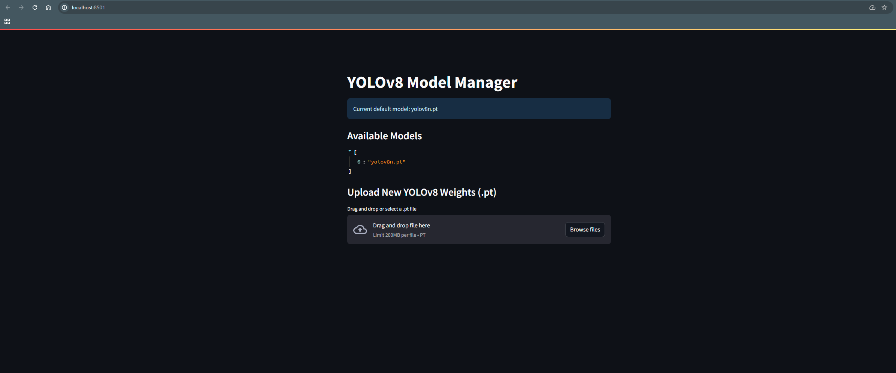

# 🎯 MCP Vision Adapter for N8N

<p align="center">
  
  
  
  
</p>

<h2 align="center">🚀 N8N ile YOLO Object Detection - Tek Komutla Hazır!</h2>

**MCP Vision Adapter**, N8N kullanıcılarının **MCP Client Tool** ile **Ultralytics YOLO** modellerini anında çalıştırabilmesi için tasarlanmış profesyonel Docker çözümüdür.

<p align="center">
  
</p>

---

## ⚡ Hızlı Başlangıç

### 1️⃣ Repo'yu İndir ve Başlat
```bash
git clone https://github.com/MetehanYasar11/mcp-server-adapter.git
cd mcp-server-adapter
docker-compose up -d
```

### 2️⃣ N8N'de MCP Client Tool Ayarları
N8N workflow'unda **MCP Client Tool** node'u ekleyin:

- **Connection Type**: `Server-Sent Events (SSE)`
- **SSE Endpoint**: `http://mcp-vision-adapter:3000/sse`
- **Authentication**: `None`

> **Docker Network**: N8N container'ınızı `mcp_network`'e bağladığınızdan emin olun.

### 3️⃣ Test Edin! 🎉
N8N'de artık şu MCP araçlarını kullanabilirsiniz:
- `detect_objects` - Görüntülerde nesne tespiti
- `yolo_cli` - Gelişmiş YOLO komutları

---

## 🏗️ Sistem Mimarisi

```
┌─────────────┐    SSE/HTTP    ┌─────────────────┐    REST API    ┌─────────────┐
│   N8N       │ ◄────────────► │ MCP Vision      │ ◄────────────► │ YOLO        │
│ Workflows   │                │ Adapter         │                │ Service     │
│             │                │ (Node.js)       │                │ (FastAPI)   │
└─────────────┘                └─────────────────┘                └─────────────┘
      │                               │                                    │
      │                               │                                    │
      ▼                               ▼                                    ▼
  Port 5678                      Port 3000                          Port 8080/8501
                                                                   (API + Streamlit)
```

---

## 🛠️ Özellikler

### 🔥 N8N Entegrasyonu
- ✅ **MCP Protocol 2024-03-26** standardı
- ✅ **Server-Sent Events (SSE)** transport katmanı
- ✅ **Zero-config** N8N bağlantısı
- ✅ **Real-time** görüntü işleme

### 🤖 Ultralytics YOLO
- ✅ **YOLOv8n/s/m/l/x** model desteği
- ✅ **Object Detection** ve **Instance Segmentation**
- ✅ **Custom model** yükleme imkanı
- ✅ **Streamlit Web UI** ile görsel yönetim

### 🐳 Docker Optimizasyonu
---

## 📋 MCP Tools ve Kullanım

### 🎯 `detect_objects`
Görüntülerde nesne tespiti yapar:

```json
{
  "tool": "detect_objects",
  "input": {
    "image_path": "/path/to/image.jpg",
    "confidence": 0.5,
    "model": "yolov8n.pt"
  }
}
```

### ⚡ `yolo_cli`
Gelişmiş YOLO komutları çalıştırır:

```json
{
  "tool": "yolo_cli", 
  "input": {
    "command": "yolo predict model=yolov8s.pt source=image.jpg save=true"
  }
}
```

---

## � Kurulum Detayları

### Docker Network Bağlantısı

N8N'i doğru network'e bağlamak için:

```bash
# N8N container'ını MCP network'e bağla
docker network connect mcp_network <n8n_container_name>

# Veya N8N'i compose ile başlatırken:
# docker-compose.yml dosyanızda networks: [mcp_network] ekleyin
```

### Manuel Test

```bash
# MCP Adapter sağlık kontrolü
curl http://localhost:3000/health

# YOLO Service test
curl -F file=@test.jpg http://localhost:8080/detect

# N8N'den MCP test (container içinden)
docker exec n8n curl http://mcp-vision-adapter:3000/health
```

---

## 🎨 Streamlit Web UI

YOLO modellerinizi görsel olarak yönetmek için:

- **URL**: http://localhost:8501
- **Model yükleme/değiştirme**
- **Canlı görüntü analizi**
- **Batch işleme**

---

## ⚙️ Konfigürasyon

### Environment Variables

```bash
# MCP Adapter
PORT=3000
YOLO_SERVICE_URL=http://yolo:8080

# YOLO Service  
YOLO_MODEL_PATH=/weights/yolov8n.pt
UPLOAD_DIR=/tmp/uploads
```

### Custom Models

```bash
# models/ klasörüne kendi modelinizi ekleyin
cp my_custom_yolo.pt models/
```

Docker Compose otomatik olarak modelleri container'a mount eder.

---

## 🧪 Test ve Geliştirme

### Test Çalıştırma

```bash
# Tüm testler
pytest tests/ -v

# Specific test
pytest tests/test_manual.py -v

# MCP protocol test
pytest tests/test_protocol.py -v
```

### Debug Mode

```bash
# Adapter'ı debug mode'da çalıştır
DEBUG=1 docker-compose up

# Logları takip et
docker-compose logs -f mcp-vision-adapter
```

#### Run Any Ultralytics CLI Command
```powershell
Invoke-RestMethod -Uri "http://localhost:3000/execute" -Method Post -ContentType "application/json" -Body '{"tool":"yolo_cli","input":{"args":"train model=yolov8n.pt data=coco128.yaml epochs=1"}}'
```

---

### STDIO Mode (Currently not supported for VS Code Copilot tool execution)
```
python -m mcp_vision_adapter.main
```
> ⚠️ **Note:** VS Code Copilot tool execution via STDIO is currently not supported. Please use the HTTP API for full integration. This will be fixed in an upcoming update.
## 🤝 Contributing

We welcome contributions! See [CONTRIBUTING.md](CONTRIBUTING.md) for guidelines. The goal is to make this repo a hub for connecting classic automations and tools to modern LLM/agent environments. Contact [Metehan Yaşar on LinkedIn](https://www.linkedin.com/in/metehan-y-16475a164/) for questions or collaboration.

---

---

## 🤝 Katkı ve Destek

### 💡 Issue Bildirimi
- **Bug Report**: GitHub Issues'da detaylı açıklama ile bildirin
- **Feature Request**: Yeni özellik önerileri hoş karşılanır
- **N8N Integration**: N8N ile ilgili problemler için log'ları ekleyin

### � Geliştirme
```bash
# Fork repo
git clone https://github.com/YOUR_USERNAME/mcp-server-adapter.git
cd mcp-server-adapter

# Branch oluştur
git checkout -b feature/your-feature

# Test ve commit
pytest tests/ -v
git commit -m "feat: your awesome feature"
git push origin feature/your-feature
```

### 📞 İletişim
- **GitHub Issues**: Teknik problemler için
- **Discussions**: Genel sorular ve öneriler için

---

## 📄 Lisans

Bu proje **MIT Lisansı** ile lisanslanmıştır - detaylar için [LICENSE](LICENSE) dosyasına bakın.

### 🙏 Teşekkürler

- **[Ultralytics](https://ultralytics.com/)** - YOLOv8 modelleri için
- **[N8N](https://n8n.io/)** - Workflow automation platform
- **[Microsoft](https://github.com/microsoft/model-context-protocol)** - Model Context Protocol standardı için

---

<p align="center">
  <strong>⭐ Beğendiyseniz star verin | 🍴 Fork'layın | 🐛 Issue açın</strong>
</p>

<p align="center">
  Made with ❤️ for N8N Community
</p>

---

## 🧪 Testing

```powershell
pip install fastapi uvicorn pytest
pytest -q
```

Tests:
- `test_service_detect.py`: YOLOv8 service (direct)
- `test_adapter_proxy.py`: Adapter → YOLOv8 service
- `test_stdio_exec.py`, `test_exec_env.py`: STDIO and env tests
- All tests are automated and end-to-end

---

## 📝 Notes

- For video, use `start`/`end` (e.g. `?start=2s&end=5s`) or `frame` params.
- If neither `manual_result` nor `MANUAL_RESULT` is set and the adapter is not running in a TTY, a placeholder is returned.

---

### ⚠️ Port Clash

If Uvicorn port 3000 is busy, stop the previous process (CTRL-C) or run with `--port 3001` and update `mcp.json` accordingly.

---

## 🌍 Open Source & License

This project is open source under the MIT license. Contributions are welcome!

---

## Security & Privacy

- No secret keys, passwords, or access tokens are included in the codebase.
- Example values like `GITHUB_PERSONAL_ACCESS_TOKEN` are for documentation and test purposes only. Always use your own keys securely.

---

## 🇹🇷 Türkçe Dokümantasyon

Bu projenin Türkçe dokümantasyonu da mevcuttur. [README.tr.md](README.tr.md) dosyasına göz atabilirsiniz.
