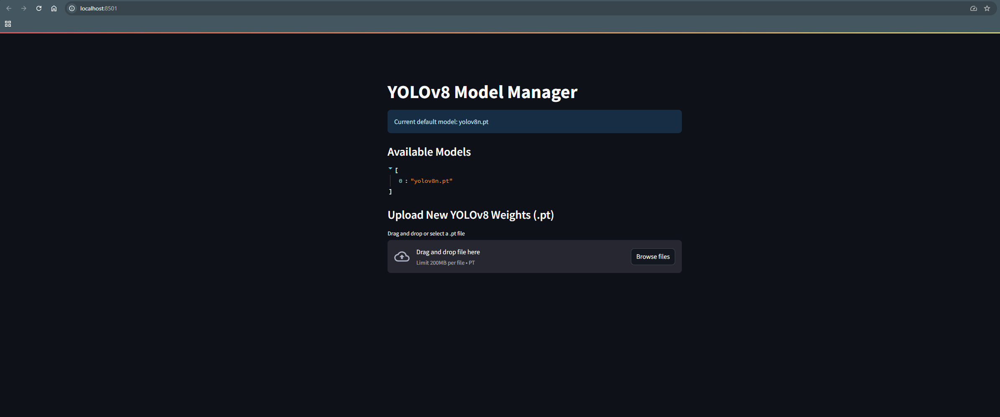

# YOLOv8 Microservice Usage & Streamlit UI

## Model Management with Streamlit UI

This service includes a built-in Streamlit web interface for managing YOLOv8 model weights. You can:
- View available YOLOv8 `.pt` models in the `/models` directory
- Upload new YOLOv8 weights via the browser
- See and set the current default model

### How to Use

1. **Start the YOLOv8 microservice** (see Docker instructions in README)
2. **Access the Streamlit UI:**
   - Open your browser and go to: [http://localhost:8501](http://localhost:8501)
   - You will see a model manager interface (see screenshot below)

- Uploaded models are saved to the `/models` directory and become available for detection/segmentation/pose tasks.
- The default model can be set via the `DEFAULT_MODEL` environment variable.

---

## Example: Uploading a Model

1. Drag and drop a `.pt` file in the UI or use the file selector.
2. The model will be uploaded and listed among available models.
3. You can now use this model for detection tasks via the API.

---

## API + UI = Flexible Workflow

- Use the REST API for programmatic access
- Use the Streamlit UI for easy model management
- Both run in the same container/service by default

---

## Video Inference & ffmpeg Requirement

For video inference (e.g., slicing `test.mp4` into frames for detection), the service relies on [ffmpeg](https://ffmpeg.org/). **You must have ffmpeg installed and available in your system PATH.**

- On Linux/macOS: ffmpeg is usually available via your package manager (e.g., `sudo apt install ffmpeg`).
- On Windows: Download the static build from [ffmpeg.org/download.html](https://ffmpeg.org/download.html), extract it, and add the `bin` directory to your system PATH. Restart your terminal or computer after updating PATH.

If ffmpeg is not installed, video-based tests and inference will fail.

---
